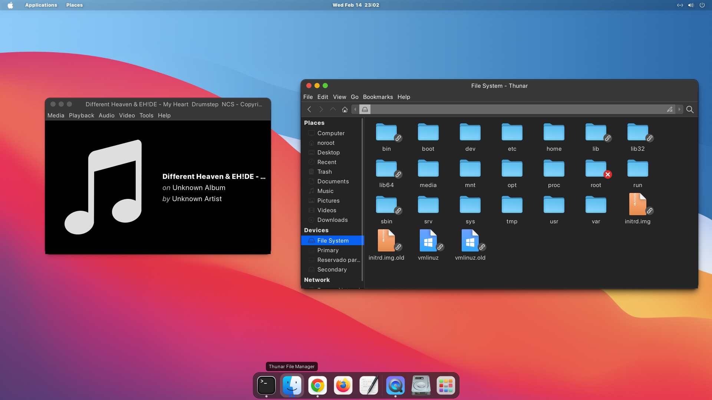
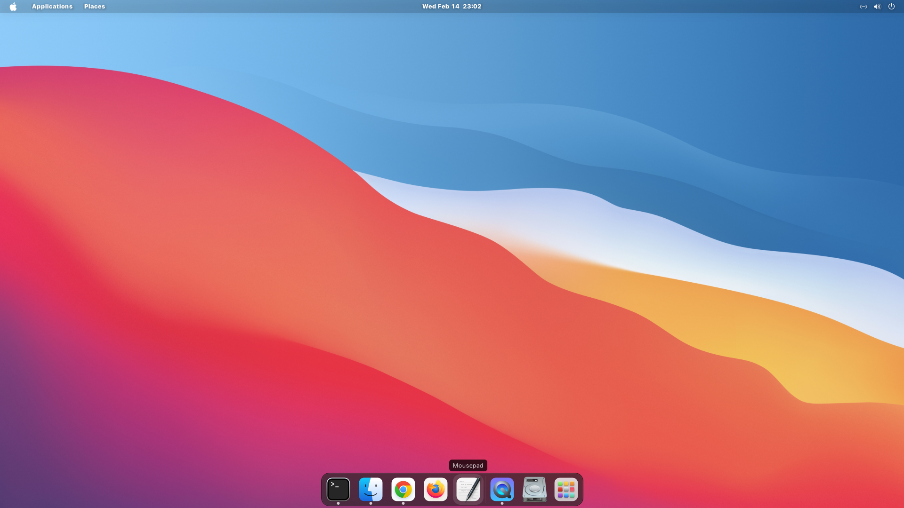

# Screen



### Config gnome-terminal
```
sudo apt-get install dconf-cli
dconf dump /org/gnome/terminal/legacy/profiles:/ > gnome-terminal-config.txt  // export config
dconf load /org/gnome/terminal/legacy/profiles:/ < gnome-terminal-config.txt  // load config
```
